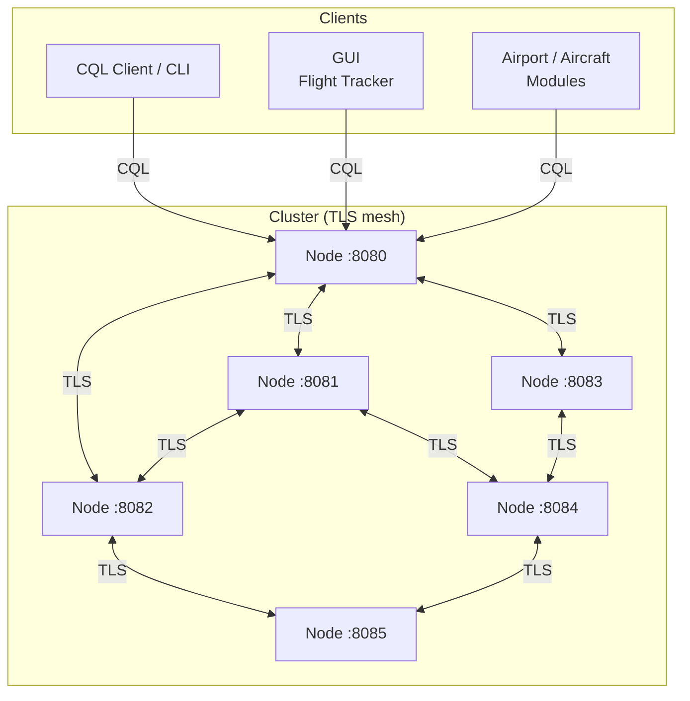

# Aerolíneas Rústicas: Distributed Database Engine

> A Cassandra-compatible distributed database engine built from scratch in Rust, with a full airline operations demo application.


---

## Overview

This project implements a distributed, fault-tolerant database system modeled after Apache Cassandra, written entirely in Rust. It includes a custom CQL parser, a replication engine, TLS-secured inter-node communication, and a read-repair mechanism, all built from the ground up without relying on existing database libraries.

The system is demonstrated through an airline operations application that tracks live flights and airport activity across a distributed cluster.

---

## Features

### Database Engine
- **CQL support**: parses and executes `SELECT`, `INSERT`, `UPDATE`, `DELETE`, `CREATE KEYSPACE`, and `CREATE TABLE` statements, including `WHERE` clauses, `PRIMARY KEY` definitions, and `USING CONSISTENCY` directives
- **Keyspace & table management**: supports multiple keyspaces with independent schemas and replication settings
- **Configurable replication**: `SimpleStrategy` replication with a tunable replication factor per keyspace
- **Consistency levels**: `ONE`, `QUORUM`, and `ALL` consistency levels on reads and writes
- **Read-repair**: detects and corrects stale replicas on read, keeping data consistent across the cluster

### Distributed Systems
- **Peer-to-peer cluster**: nodes communicate directly with each other; no single point of coordination
- **Dynamic cluster membership**: nodes can be added or removed at runtime via the `ADAPT` flag without a full cluster restart
- **Partitioning**: data is distributed across nodes using a deterministic partitioning scheme based on the primary key
- **Message serialization**: custom binary protocol for inter-node communication with full serialization/deserialization

### Security
- **TLS encryption**: all inter-node and client-node traffic is encrypted using TLS with EC keys (prime256v1)
- **Authentication challenges**: nodes authenticate each other before accepting connections

### Infrastructure
- **Thread pool**: custom-built thread pool for handling concurrent client connections
- **Docker deployment**: each node runs in its own container; the cluster is orchestrated with `docker-compose`
- **Structured logging**: per-node logs for observing replication, repairs, and cluster events

### Demo Application
- Real-time flight tracking GUI
- Airport and aircraft management modules
- Two independent keyspaces: live flights and aircraft on the ground

---

## Architecture



Each node stores its data shard locally and replicates writes to the appropriate replica nodes based on the replication factor. Reads can trigger repair if a replica is found to be behind.

---

## Getting Started

### Prerequisites

- [Rust](https://rustup.rs/) (stable)
- [Docker](https://docs.docker.com/get-docker/) + docker-compose

### TLS Setup

Generate the self-signed certificate used by the nodes:

```bash
openssl req -x509 -newkey ec -pkeyopt ec_paramgen_curve:prime256v1 \
  -keyout server.key -out server.crt -nodes -days 36500 -config openssl.cnf
```

`openssl.cnf` example:

```ini
[ req ]
distinguished_name = req_distinguished_name
x509_extensions    = v3_req
prompt             = no

[ req_distinguished_name ]
CN = localhost

[ v3_req ]
subjectAltName = @alt_names

[ alt_names ]
DNS.1 = localhost
IP.1  = 127.0.0.1
```

### Running with Docker (recommended)

```bash
# Clean up any previous state
docker-compose down -v

# Build node images
docker-compose build

# Set cluster size and adaptation mode
echo "NODOS=6" > .env
echo "ADAPT=0" >> .env

# Start each node in a separate terminal
docker-compose up nodo8080
docker-compose up nodo8081
docker-compose up nodo8082
docker-compose up nodo8083
docker-compose up nodo8084
docker-compose up nodo8085
```

Wait a few seconds for all nodes to initialize before sending queries.

### Running the Application Modules

From `./tp_aerolineas/`:

```bash
cargo run --bin tp_aerolineas cliente     # CQL shell
cargo run --bin tp_aerolineas grafica     # Flight tracking GUI
cargo run --bin tp_aerolineas avion       # Aircraft management
cargo run --bin tp_aerolineas aeropuerto  # Airport management
```

### Running Nodes Locally (no Docker)

```bash
mkdir -p tp_aerolineas/nodos/nodo8080
cd tp_aerolineas/nodos/nodo8080
cargo run --bin tp_aerolineas 8080 6
```

Repeat for each node port (8080–8085), each in its own directory and terminal.

---

## Schema Setup

Connect with the CQL client and run:

```sql
CREATE KEYSPACE keyspace1 WITH REPLICATION = {'class': 'SimpleStrategy', 'replication_factor': 3};

CREATE TABLE keyspace1.aviones_volando (
  flight_number   INT,
  origin          VARCHAR(100),
  destination     VARCHAR(100),
  lat             FLOAT,
  lon             VARCHAR(100),
  altitude        VARCHAR(100),
  speed           INT,
  airline         VARCHAR(100),
  direction       VARCHAR(50),
  fuel_percentage FLOAT,
  status          VARCHAR(100),
  fecha           VARCHAR(100),
  PRIMARY KEY ((flight_number, origin, destination), origin, fecha)
);

CREATE KEYSPACE keyspace2 WITH REPLICATION = {'class': 'SimpleStrategy', 'replication_factor': 3};

CREATE TABLE keyspace2.aviones_en_aeropuerto (
  flight_number VARCHAR(100),
  origin        VARCHAR(100),
  destination   VARCHAR(100),
  airline       VARCHAR(100),
  departure     VARCHAR(100),
  state         VARCHAR(100),
  fecha         VARCHAR(100),
  PRIMARY KEY ((flight_number, origin), origin, fecha)
);
```

---

## Dynamic Cluster Resizing

The cluster supports live node addition and removal via the `ADAPT` flag.

**Remove nodes**: set `NODOS=4` and `ADAPT=1`, then bring down the nodes no longer in use. Queries will stop routing to them.

**Add nodes**: set `NODOS=6` and `ADAPT=1`, then start the new node containers. The cluster will incorporate them.

Logs inside each node's folder record replication and repair events during adaptation.

---

## Read-Repair Demo

1. Start all 6 nodes and run `aeropuerto` to generate writes
2. Kill node `nodo8081`
3. Stop `aeropuerto`
4. Open the CQL client and query a record:
   ```sql
   SELECT * FROM keyspace1.aviones_volando USING CONSISTENCY ONE
   WHERE flight_number = 'EK333';
   ```
5. Restart node `nodo8081` and send the same query again: the node will receive the repaired data

---

## Running Tests

```bash
# Start 4 test nodes
docker-compose up nodo8080
docker-compose up nodo8081
docker-compose up nodo8082
docker-compose up nodo8083

# In a fifth terminal
cd tp_aerolineas
cargo test
```

---

## Background

This project originated as the final assignment for the *Taller de Programación* course at [FIUBA](https://fi.uba.ar/) (Universidad de Buenos Aires, Faculty of Engineering), built in 2024 by:

- Borthaburu, Isidro Héctor
- Cano Ros Langrehr, María Delfina
- Di Nucci, Tomás Franco
- Wainwright, Martín

The original submission, with its academic structure and documentation, is preserved in [`ACADEMIC_ORIGIN.md`](./ACADEMIC_ORIGIN.md) and the [PDF reports](./Informe%20Final%20TP%20aerol%C3%ADneas%20r%C3%BAsticas.pdf) included in this repository.

After the course ended, the codebase was taken further: the README was rewritten, the project structure was cleaned up, and additional improvements were made beyond what the original assignment required.

The name *Aerolíneas Rústicas* is a play on **Rust** and *Aerolíneas Argentinas*, the Argentine national airline.

---

## License

[MIT](./LICENSE)
